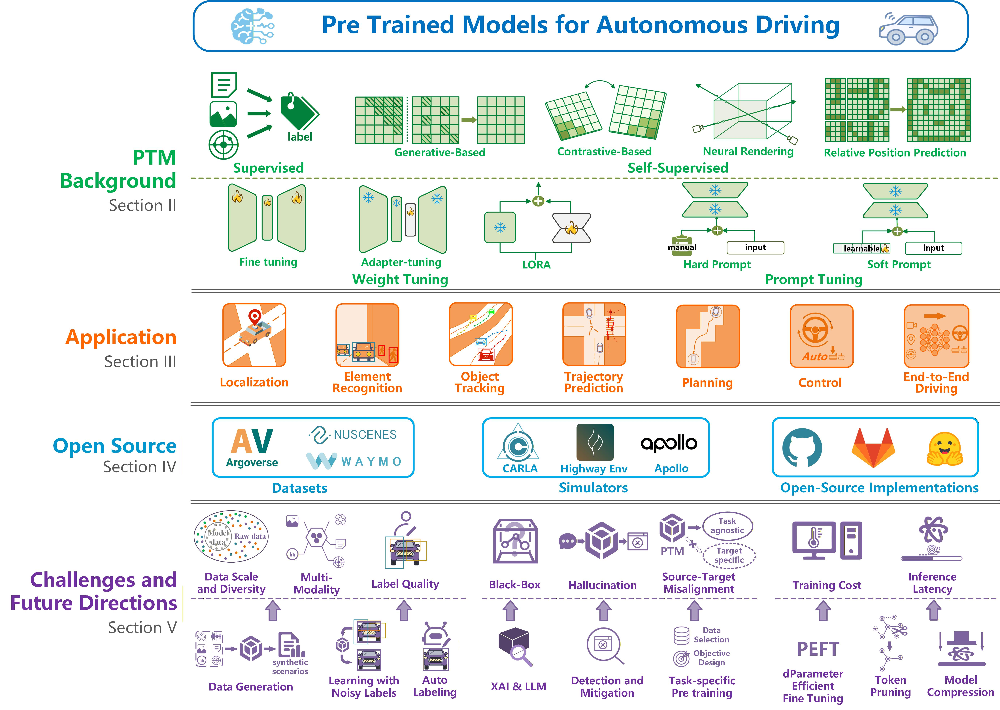

# PTM4AD

# Paper Architecture

# Datasets
### Perception Datasets
| Dataset        | Year | Size    | 2D Det | 3D Det | 2D Seg | 3D Seg | Tracking | Lane Det |
|---------------|------|---------|--------|--------|--------|--------|----------|----------|
| **Onboard**   |      |         |        |        |        |        |          |          |
| nuScenes      | 2019 | 40K     | ✓      | ✓      | ✓      | ✓      | ✓        | ✓        |
| Cityscapes    | 2016 | 25K     | ✓      | ✓      | ✓      |        |          |          |
| BDD100K       | 2020 | 12M     | ✓      |        | ✓      |        | ✓        | ✓        |
| Waymo         | 2019 | 230K    | ✓      | ✓      | ✓      |        | ✓        |          |
| KITTI         | 2012 | 41K     | ✓      | ✓      |        |        |          |          |
| SYNTHIA       | 2016 | 13.4K   |        |        | ✓      |        |          |          |
| Apolloscape   | 2018 | 143,906 | ✓      | ✓      | ✓      | ✓      | ✓        |          |
| SemanticKITTI | 2019 | 43,552  |        |        |        | ✓      |          |          |
| Virtual KITTI | 2016 | 21,260  | ✓      |        | ✓      |        |          |          |
| VIPER         | 2017 | 254,064 | ✓      | ✓      | ✓      | ✓      | ✓        |          |
| GTA5          | 2016 | 24,966  |        |        | ✓      |        |          |          |
| Argoverse 2   | 2023 | 6M      | ✓      | ✓      |        |        | ✓        |          |
| Lane Det      | 2017 | 133,235 |        |        |        |        |          | ✓        |
| SHIFT         | 2022 | 2.5M    | ✓      | ✓      | ✓      |        | ✓        |          |
| CityPersons   | 2017 | 25K     | ✓      |        | ✓      |        |          |          |
| A2D2          | 2020 | 41,277  | ✓      | ✓      | ✓      |        |          |          |
| Foggy Cityscapes | 2018 | 20,550 | ✓    |        | ✓      |        |          |          |
| CamVid        | 2009 | 701     |        |        | ✓      |        |          |          |
| IDD           | 2019 | 10,004  |        |        | ✓      |        |          |          |
| CAOS          | 2022 | 13K     |        |        | ✓      |        |          |          |
| RADIATE       | 2021 | 44,140  | ✓      |        |        | ✓      |          |          |
| Virtual KITTI 2 | 2020 | 20,992 | ✓     | ✓      | ✓      |        | ✓        |          |
| KITTI-360     | 2021 | 150K    | ✓      | ✓      | ✓      | ✓      | ✓        |          |
| Dr(eye)ve     | 2018 | 555,000 |        |        | ✓      |        |          |          |
| ACDC          | 2021 | 4,006   |        |        | ✓      |        |          |          |
| GTSDB         | 2013 | 900     | ✓      |        |        |        |          |          |
| ONCE          | 2021 | 1M      | ✓      | ✓      |        |        |          |          |
| Caltech Ped   | 2009 | 250K    | ✓      |        |        |        |          |          |
| STF           | 2020 | 13,500  | ✓      | ✓      |        |        |          |          |
| **V2X**       |      |         |        |        |        |        |          |          |
| TUMTraf       | 2022 | 50,253  | ✓      | ✓      | ✓      |        | ✓        | ✓        |
| DAIR-V2X      | 2021 | 71,254  | ✓      | ✓      |        |        |          |          |
| V2XSet        | 2022 | 11,447  | ✓      | ✓      |        |        |          |          |
| V2V4Real      | 2023 | 40K     | ✓      | ✓      |        |        | ✓        |          |
| Rope3D        | 2022 | 50K     | ✓      | ✓      |        |        |          |          |
| V2X-Sim       | 2022 | 10K     | ✓      | ✓      | ✓      | ✓      | ✓        |          |
| V2VNet        | 2020 | 51.2K   | ✓      |        |        |        |          |          |
| T&J           | 2019 | 100     | ✓      | ✓      |        |        |          |          |
| Co-Percep     | 2020 | 10K     | ✓      | ✓      |        |        |          |          |
| DeepAccident  | 2023 | 285K    |        |        |        |        |          |          |
| LUMPI         | 2022 | 200K    | ✓      | ✓      | ✓      |        | ✓        |          |
| **Drone**     |      |         |        |        |        |        |          |          |
| UAVDT         | 2018 | 80K     | ✓      |        |        |        | ✓        |          |
| DroneVehicle  | 2021 | 28,439  | ✓      |        |        |        |          |          |
| **Others**    |      |         |        |        |        |        |          |          |
| Mapillary Vistas | 2017 | 25K  |        |        | ✓      |        |          |          |
| TT 100K       | 2016 | 100K    | ✓      |        |        |        |          |          |
| Pascal3D+     | 2014 | 30,899  | ✓      | ✓      | ✓      |        |          |          |
| WildDash      | 2018 | 1,800   |        |        | ✓      |        |          |          |
| TorontoCity   | 2016 | 56K     |        |        | ✓      |        |          |          |
| DAWN          | 2020 | 4,543   | ✓      |        |        |        |          |          |
| RAD           | 2019 | 60      |        |        | ✓      |        |          |          |
| STCrowd       | 2022 | 10,891  | ✓      | ✓      |        |        | ✓        |          |

### Prediction, Planning, and Control Datasets

| Dataset | Year | Size | Tasks |
|---------|------|-------|-------|
| Brain4Cars | 2015 | 2M frames | maneuver anticipation |
| JAAD | 2017 | 75K frames | pedestrian intention |
| Dr(eye)ve | 2018 | 500K frames | driver attention prediction |
| highD | 2018 | 45K km | trajectory prediction |
| PIE | 2019 | 293K frames | pedestrian intention |
| USyd | 2019 | 24K trajectories | driver intention |
| Argoverse | 2019 | 300K trajectories | trajectory prediction |
| Drive&Act | 2019 | 9.6M images | driver behavior recognition |
| DbNet | 2019 | 100 km | driver behavior recognition |
| D²CAV | 2020 | - | behavioral strategy |
| inD | 2020 | 11.5K trajectories | road user prediction |
| PePscenes | 2020 | 719 frames | pedestrian behavior prediction |
| openDD | 2020 | 84,774 trajectories | pedestrian behavior prediction |
| nuPlan | 2021 | 1.5K hours | motion planning |
| DriPE | 2021 | 10K images | driver behavior recognition |
| Speak2label | 2021 | 586 videos | attention prediction |
| CoCAtt | 2022 | 11.9 hours | attention prediction |
| exiD | 2022 | 16 hours | trajectory prediction |
| MONA | 2022 | 702K trajectories | trajectory prediction |
| Occ3D-nuScenes | 2024 | 40K frames | occupancy prediction |
| Occ3D-Waymo | 2024 | 200K frames | occupancy prediction |

### End-to-End Autonomous Driving Datasets

| Dataset | Year | Sensors | Content | Weather | Size | Location |
|---------|------|---------|----------|----------|--------|-----------|
| Udacity | 2016 | Camera, LiDAR, GNSS, Steering, Speed | Obstacles, Traffic, Roads | Sunny | 5h | Mountain View |
| Drive360 | 2019 | Camera, GNSS, Steering, Speed, Route | Obstacles, Traffic | Sunny, Rain | 55h | Switzerland |
| Comma.ai 2016 | 2016 | Camera, GNSS, Steering, Speed | - | Sunny | 7h15m | SF, USA |
| Comma.ai 2019 | 2019 | Camera, GNSS, Steering, Speed | - | Sunny | 30h | San Jose |
| BDD100 | 2018 | Camera, GNSS | Obstacles, Traffic | Sunny, Rain, Snow | 1100h | USA |
| Oxford RobotCar | 2019 | Camera, LiDAR, GNSS | Obstacles, Traffic | Sunny, Rain, Snow | 214h | Oxford |
| HDD | 2018 | Camera, LiDAR, GNSS, Steering, Speed, Nav | Obstacles | - | 104h | SF, USA |
| Brain4Cars | 2016 | Camera, GNSS, Steering, Speed | Obstacles | - | 1180 miles | USA |
| Li-Vi | 2018 | Camera, LiDAR, GNSS, Steering, Speed | - | - | 10h | China |
| DDD17 | 2017 | Event Cam, GNSS, Steering | Obstacles | Sunny, Rain, Snow | 12h | EU |
| A2D2 | 2020 | Camera, LiDAR, GNSS, Steering, Speed | Obstacles | Sunny, Rain | 390K frames | Germany |
| nuScenes | 2019 | Camera, LiDAR, GNSS | Obstacles | Sunny, Rain | 5.5h | Boston, Singapore |
| Waymo | 2019 | Camera, LiDAR, GNSS | Obstacles | Sunny, Rain | 5.5h | California |
| H3D | 2019 | Camera, LiDAR, GNSS, Steering, Speed | - | Sunny | N/A | Japan |
| HAD | 2019 | Camera, GNSS, Steering, Speed, Nav | Traffic | Sunny | 30h | SF |
| BIT | 2015 | Camera | Obstacles | Sunny | 9850 frames | Beijing |
| UA-DETRAC | 2015 | Camera | Obstacles | Sunny | 140K frames | Beijing, Tianjin |
| DFG | 2019 | Camera | Traffic | Sunny, Snow | 7K+8K | Slovenia |
| Bosch | 2017 | Camera | Traffic | Sunny | 8K | Germany |
| Tencent 100K | 2016 | Camera | Traffic | Sunny | 30K | China |
| LISA | 2012 | Camera | Traffic | Sunny | 20K | California |
| STSD | 2011 | Camera | Traffic | Sunny | 2503 | Sweden |
| GTSRB | 2013 | Camera | Traffic | Sunny, Snow | 50K | Germany |
| KUL | 2013 | Camera | Traffic | Sunny | 16K | Belgium |
| Caltech | 2009 | Camera | Obstacles | Sunny | 10h | California |
| CamVid | 2009 | Camera | Obstacles, Roads | Sunny | 22m | Cambridge |
| Ford | 2018 | Camera, LiDAR | Obstacles | Sunny | 66km | Michigan |
| KITTI | 2013 | Cam, LiDAR, GNSS | Obstacles | Sunny | 43K | Germany |
| CityScapes | 2016 | Camera, GNSS | Obstacles | Sunny | 25K | EU |
| Mapillary | 2017 | Camera | Obstacles | All | 25K | Germany |
| ApolloScape | 2018 | Cam, LiDAR | Obstacles | All | 147K | China |
| VERI-Wild | 2019 | Camera | Obstacles | All | 125–280h | China |
| D2-City | 2019 | Camera | Obstacles, Roads | All | 10K videos | China |
| DriveSeg | 2020 | Camera | Obstacles | Sunny | 500m | USA |

### Emerging: Language-Based Autonomous Driving Datasets

| Dataset | Year | Size | Tasks |
|---------|------|-------|--------|
| BDD-X | 2018 | 8.4M | reasoning, planning |
| Cityscapes-Ref | 2018 | 5K | object referring |
| TOUCHDOWN | 2019 | 9,326 | reasoning, navigation |
| Talk2Car | 2019 | 11,959 cmd | object referring |
| BDD-OIA | 2020 | 11,303 | explainable decision-making |
| CityFlow-NL | 2021 | 5,289 | object tracking |
| CARLA-NAV | 2022 | 83K | navigation |
| NuPrompt | 2023 | 34K | multi-object tracking |
| NuScenes-QA | 2023 | 460K QA | VQA |
| Refer-KITTI | 2023 | 6,650 | referring MOT |
| Driving LLMs | 2023 | 160K QA | VQA |
| DRAMA | 2023 | 17,785 | reasoning, VQA |
| Rank2Tell | 2023 | 116 | importance ranking |
| LamPilot | 2023 | 4,900 | planning |
| LangAuto CARLA | 2023 | 64K | closed-loop driving |
| NuScenes-MQA | 2023 | 1.4M QA | VQA |
| DriveMLM | 2023 | 280h | planning, control |
| DriveLM-nuScenes | 2023 | 4,871 | E2E driving |
| DriveCARLA | 2023 | 183K | E2E driving |
| LiDAR-text | 2023 | 420K / 280K | 3D captioning & grounding |
| Talk2BEV | 2023 | 20K QA | decision, intention, reasoning |
| NuScenes-MQA (2024) | 2024 | 1.4M QA | VQA |
| VLAAD | 2024 | 10,379 | VQA, reasoning |

## Simulators

