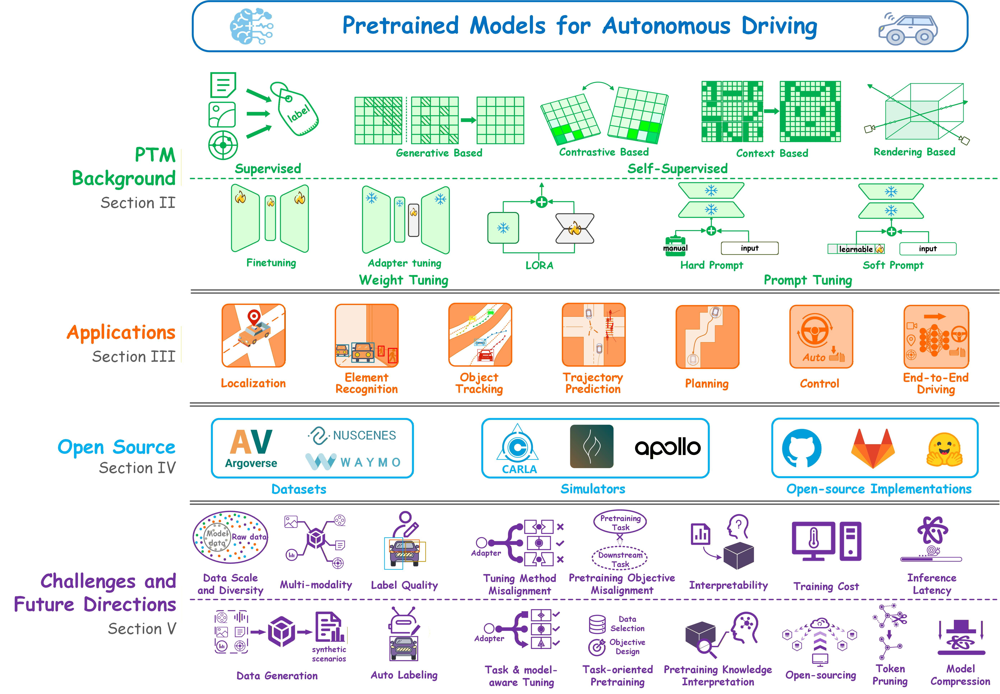
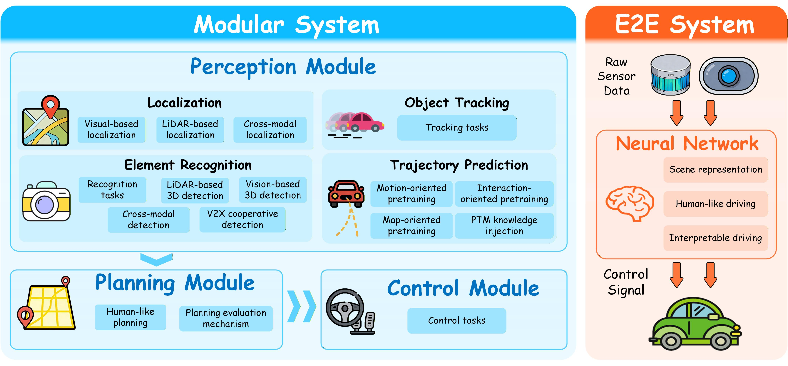

> **A curated list of research papers and resources about Pretrained Models (PTMs) for Autonomous Driving.**

This repository tracks the frontier of **PTM4AD**, encompassing Modular Systems (Localization, Perception, Prediction, Planning) and End-to-End Systems. It explores how pretraining strategies (e.g., Contrastive Learning, Masked Autoencoding, LLM/VLM integration) are revolutionizing the AD domain.

*Maintained by the WHUT-AutoAI PTM4AD Team.*

👋 **Welcome to contribute!** If you find any related materials helpful or missing, feel free to contact us or make a Pull Request.
* **Contact:** 286322@whut.edu.cn, zyh_5@whut.edu.cn, ghc0910@whut.edu.cn

## 📝 Citation
Our survey paper is currently under review. The citation information will be updated here soon.

**The GitHub Pages was updated on April 23, 2026.**

## 📖 Table of Contents
- [Overview](#-overview)
- [Papers](#-papers)
  - [Modular System](#modular-system)
    - [Localization](#localization)
    - [Detection & Segmentation & Tracking](#detection--segmentation--tracking)
    - [Trajectory Prediction](#trajectory-prediction)
    - [Planning & Control](#planning--control)
  - [End-to-End System](#end-to-end-system)
- [Datasets](#-datasets)
- [Simulators](#-simulators)

---

## 🚀 Overview

## 🚀 Task-oriented Taxonomy

## 🚀 Challenges and Future Directions

---

## 📚 Papers

### Modular System

### Localization

| Name | Link | Code |
| --- | --- | --- |
| Fine-grained segmentation networks: Self supervised segmentation for improved long-term visual localization | [📄](https://openaccess.thecvf.com/content_ICCV_2019/papers/Larsson_Fine-Grained_Segmentation_Networks_Self-Supervised_Segmentation_for_Improved_Long-Term_Visual_Localization_ICCV_2019_paper.pdf) | [💻](https://github.com/maunzzz/fine-grained-segmentation-networks) |
| Semantics-aware visual localization under challenging perceptual conditions | [📄](http://ais.informatik.uni-freiburg.de/publications/papers/naseer17icra.pdf) | - |
| Semantic pose verification for outdoor visual localization with self-supervised contrastive learning | [📄](https://openaccess.thecvf.com/content/CVPR2022W/L3D-IVU/papers/Orhan_Semantic_Pose_Verification_for_Outdoor_Visual_Localization_With_Self-Supervised_Contrastive_CVPRW_2022_paper.pdf) | - |
| Accurate visual localization for automotive applications | [📄](https://openaccess.thecvf.com/content_CVPRW_2019/papers/WAD/Brosh_Accurate_Visual_Localization_for_Automotive_Applications_CVPRW_2019_paper.pdf) | [💻](https://github.com/getnexar/Nexar-Visual-Localization) |
| Slice transformer and self-supervised learning for 6dof localization in 3d point cloud maps | [📄](https://arxiv.org/pdf/2301.08957) | - |
| Lip-loc: Lidar image pretraining for cross-modal localization | [📄](https://openaccess.thecvf.com/content/WACV2024W/LLVM-AD/papers/Shubodh_LIP-Loc_LiDAR_Image_Pretraining_for_Cross-Modal_Localization_WACVW_2024_paper.pdf) | - |
| Contrastive learning-based place descriptor representation for cross-modality place recognition | [📄](https://www.sciencedirect.com/science/article/pii/S1566253525004245?ref=pdf_download&fr=RR-2&rr=9a711892792de300) | - |
| Global visual localization in lidar-maps through shared 2d-3d embedding space | [📄](https://arxiv.org/pdf/1910.04871) | - |
| SaliencyI2PLoc: Saliency-guided image–point cloud localization using contrastive learning | [📄](https://arxiv.org/pdf/2412.15577) | [💻](https://github.com/whu-lyh/SaliencyI2PLoc) |
| Vxp: Voxel-cross-pixel large-scale image-lidar place recognition | [📄](https://arxiv.org/pdf/2403.14594) | [💻](https://github.com/yunjinli/vxp) |

### Detection & Segmentation & Tracking

| Name | Link | Code |
| --- | --- | --- |
| Location-aware self-supervised transformers for semantic segmentation | [📄](https://openaccess.thecvf.com/content/WACV2024/papers/Caron_Location-Aware_Self-Supervised_Transformers_for_Semantic_Segmentation_WACV_2024_paper.pdf) | - |
| Detco: Unsupervised contrastive learning for object detection | [📄](https://openaccess.thecvf.com/content/ICCV2021/papers/Xie_DetCo_Unsupervised_Contrastive_Learning_for_Object_Detection_ICCV_2021_paper.pdf) | [💻](https://github.com/open-mmlab/mmselfsup) |
| Pointcontrast: Unsupervised pre-training for 3d point cloud understanding | [📄](https://arxiv.org/pdf/2007.10985) | [💻](https://github.com/facebookresearch/PointContrast) |
| GeoMAE: Masked geometric target prediction for self-supervised point cloud pre-training | [📄](https://openaccess.thecvf.com/content/CVPR2023/papers/Tian_GeoMAE_Masked_Geometric_Target_Prediction_for_Self-Supervised_Point_Cloud_Pre-Training_CVPR_2023_paper.pdf) | [💻](https://github.com/Tsinghua-MARS-Lab/GeoMAE) |
| GeoMIM: Towards better 3d knowledge transfer via masked image modeling for multi-view 3d understanding | [📄](https://openaccess.thecvf.com/content/ICCV2023/papers/Liu_GeoMIM_Towards_Better_3D_Knowledge_Transfer_via_Masked_Image_Modeling_ICCV_2023_paper.pdf) | - |
| Contrastive object-level pre-training with spatial noise curriculum learning | [📄](https://arxiv.org/pdf/2111.13651) | [💻](https://github.com/ChenhongyiYang/CCOP) |
| Univip: A unified framework for self-supervised visual pre-training | [📄](https://openaccess.thecvf.com/content/CVPR2022/papers/Li_UniVIP_A_Unified_Framework_for_Self-Supervised_Visual_Pre-Training_CVPR_2022_paper.pdf) | [💻](https://github.com/utkutpcgl/UniVIP) |
| Unsupervised object-level representation learning from scene images | [📄](https://arxiv.org/pdf/2106.11952) | [💻](https://www.mmlab-ntu.com/project/orl/) |
| Codo: Contrastive learning with downstream background invariance for detection | [📄](https://openaccess.thecvf.com/content/CVPR2022W/L3D-IVU/papers/Zhao_CoDo_Contrastive_Learning_With_Downstream_Background_Invariance_for_Detection_CVPRW_2022_paper.pdf) | - |
| Aligning pretraining for detection via object-level contrastive learning | [📄](https://arxiv.org/pdf/2106.02637) | [💻](https://github.com/ueoo/SoCo) |
| Multisiam: Self-supervised multi-instance siamese representation learning for autonomous driving | [📄](https://openaccess.thecvf.com/content/ICCV2021/papers/Chen_MultiSiam_Self-Supervised_Multi-Instance_Siamese_Representation_Learning_for_Autonomous_Driving_ICCV_2021_paper.pdf) | [💻](https://github.com/Kaichen1998/MultiSiam) |
| Proposalcontrast: Unsupervised pre-training for lidar-based 3d object detection | [📄](https://arxiv.org/pdf/2207.12654) | [💻](https://github.com/yinjunbo/ProposalContrast) |
| Temporal consistent 3d lidar representation learning for semantic perception in autonomous driving | [📄](https://openaccess.thecvf.com/content/CVPR2023/papers/Nunes_Temporal_Consistent_3D_LiDAR_Representation_Learning_for_Semantic_Perception_in_CVPR_2023_paper.pdf) | [💻](https://github.com/PRBonn/TARL) |
| Patchcontrast: Self supervised pre-training for 3d object detection | [📄](https://openaccess.thecvf.com/content/CVPR2025W/WAD/papers/Shrout_PatchContrast_Self-Supervised_Pre-Training_for_3D_Object_Detection_CVPRW_2025_paper.pdf) | - |
| Exploring geometry-aware contrast and clustering harmonization for self-supervised 3d object detection | [📄](https://openaccess.thecvf.com/content/ICCV2021/papers/Liang_Exploring_Geometry-Aware_Contrast_and_Clustering_Harmonization_for_Self-Supervised_3D_Object_ICCV_2021_paper.pdf) | [💻](https://github.com/hustvl/GCC-3D) |
| Segcontrast: 3d point cloud feature representation learning through self supervised segment discrimination | [📄](https://drive.google.com/file/d/1mJS5lO-vbdbbwexhVkManlUyQic08adN/view) | [💻](https://github.com/PRBonn/segcontrast) |
| Psa-ssl: Pose and size-aware self supervised learning on lidar point clouds | [📄](https://openaccess.thecvf.com/content/CVPR2025/papers/Nisar_PSA-SSL_Pose_and_Size-aware_Self-Supervised_Learning_on_LiDAR_Point_Clouds_CVPR_2025_paper.pdf) | - |
| Self-supervised pretraining for point cloud object detection in autonomous driving | [📄](https://ieeexplore.ieee.org/stamp/stamp.jsp?tp=&arnumber=9922494) | - |
| Cmae-3d: Contrastive masked autoencoders for self-supervised 3d object detection | [📄](https://link.springer.com/article/10.1007/s11263-024-02313-2) | - |
| LiDAR-guided geometric pretraining for vision-centric 3d object detection | [📄](https://link.springer.com/article/10.1007/s11263-025-02351-4) | [💻](https://github.com/OpenDriveLab/Birds-eye-view-Perception?tab=readme-ov-file) |
| CooPre: Cooperative pretraining for v2x cooperative perception | [📄](https://arxiv.org/pdf/2408.11241) | [💻](https://github.com/ucla-mobility/CooPre) |
| Occfeat: Self-supervised occupancy feature prediction for pretraining bev segmentation networks | [📄](https://openaccess.thecvf.com/content/CVPR2024W/WAD/papers/Sirko-Galouchenko_OccFeat_Self-supervised_Occupancy_Feature_Prediction_for_Pretraining_BEV_Segmentation_Networks_CVPRW_2024_paper.pdf) | - |
| Image-to-lidar self-supervised distillation for autonomous driving data | [📄](https://openaccess.thecvf.com/content/CVPR2022/papers/Sautier_Image-to-Lidar_Self-Supervised_Distillation_for_Autonomous_Driving_Data_CVPR_2022_paper.pdf) | [💻](https://github.com/valeoai/SLidR) |
| Self-supervised image-to-point distillation via semantically tolerant contrastive loss | [📄](https://openaccess.thecvf.com/content/CVPR2023/papers/Mahmoud_Self-Supervised_Image-to-Point_Distillation_via_Semantically_Tolerant_Contrastive_Loss_CVPR_2023_paper.pdf) | - |
| Unim 2 ae: Multi-modal masked autoencoders with unified 3d representation for 3d perception in autonomous driving | [📄](https://arxiv.org/pdf/2308.10421) | [💻](https://github.com/hollow-503/UniM2AE) |
| Learning shared rgb-d fields: Unified self-supervised pre-training for label-efficient lidar-camera 3d perception | [📄](https://arxiv.org/pdf/2405.17942) | [💻](https://github.com/Xiaohao-Xu/Unified-Pretrain-AD) |
| Pf3det: A prompted foundation feature assisted visual lidar 3d detector | [📄](https://openaccess.thecvf.com/content/CVPR2025W/WDFM-AD/papers/Li_PF3Det_A_Prompted_Foundation_Feature_Assisted_Visual_LiDAR_3D_Detector_CVPRW_2025_paper.pdf) | - |
| Vlc fusion: Vision-language conditioned sensor fusion for robust object detection | [📄](https://arxiv.org/pdf/2505.12715) | [💻](https://github.com/aditya-taparia/VLCFusion) |
| Integrating language-derived appearance elements with visual cues in pedestrian detection | [📄](https://arxiv.org/pdf/2311.01025) | [💻](https://github.com/kimhj709/LDAE) |
| Vlpd: Context-aware pedestrian detection via vision-language semantic self-supervision | [📄](https://openaccess.thecvf.com/content/CVPR2023/papers/Liu_VLPD_Context-Aware_Pedestrian_Detection_via_Vision-Language_Semantic_Self-Supervision_CVPR_2023_paper.pdf) | [💻](https://github.com/lmy98129/VLPD) |
| Representation learning for visual object tracking by masked appearance transfer | [📄](https://openaccess.thecvf.com/content/CVPR2023/papers/Zhao_Representation_Learning_for_Visual_Object_Tracking_by_Masked_Appearance_Transfer_CVPR_2023_paper.pdf) | [💻](https://github.com/difhnp/MAT) |
| Dropmae: Masked autoencoders with spatial-attention dropout for tracking tasks | [📄](https://openaccess.thecvf.com/content/CVPR2023/papers/Wu_DropMAE_Masked_Autoencoders_With_Spatial-Attention_Dropout_for_Tracking_Tasks_CVPR_2023_paper.pdf) | [💻](https://github.com/yjw0224/DropMAE) |
| Generalized relation modeling for transformer tracking | [📄](https://openaccess.thecvf.com/content/CVPR2023/papers/Gao_Generalized_Relation_Modeling_for_Transformer_Tracking_CVPR_2023_paper.pdf) | [💻](https://github.com/Little-Podi/GRM) |
| Learning correspondence from the cycle-consistency of time | [📄](https://openaccess.thecvf.com/content_CVPR_2019/papers/Wang_Learning_Correspondence_From_the_Cycle-Consistency_of_Time_CVPR_2019_paper.pdf) | [💻](https://github.com/xiaolonw/TimeCycle) |

### Trajectory Prediction

| Name | Link | Code |
| --- | --- | --- |
| Self-supervised representation learning from temporal ordering of automated driving sequences | [📄](https://arxiv.org/pdf/2302.09043) | - |
| Traj-mae: Masked autoencoders for trajectory prediction | [📄](https://openaccess.thecvf.com/content/ICCV2023/papers/Chen_Traj-MAE_Masked_Autoencoders_for_Trajectory_Prediction_ICCV_2023_paper.pdf) | [💻](https://jiazewang.com/projects/trajmae.html) |
| Sept: Towards efficient scene representation learning for motion prediction | [📄](https://arxiv.org/pdf/2309.15289) | - |
| Precln: Pretrained based contrastive learning network for vehicle trajectory prediction | [📄](https://link.springer.com/article/10.1007/s11280-022-01121-3) | - |
| Rmp: A random mask pretrain framework for motion prediction | [📄](https://arxiv.org/pdf/2309.08989) | [💻](https://github.com/KTH-RPL/RMP) |
| Smart pretrain: Model-agnostic and dataset-agnostic representation learning for motion prediction | [📄](https://arxiv.org/pdf/2410.08669) | [💻](https://github.com/youngzhou1999/SmartPretrain) |
| Behavior-pred: A semantic-enhanced trajectory pre-training framework for motion forecasting | [📄](https://www.sciencedirect.com/science/article/pii/S1566253525001599?ref=pdf_download&fr=RR-2&rr=9a711a9ea93c043e) | - |
| Redmotion: Motion prediction via redundancy reduction | [📄](https://arxiv.org/pdf/2306.10840) | [💻](https://github.com/kit-mrt/future-motion) |
| PreTraM: Self-Supervised Pre-training via Connecting Trajectory and Map | [📄](https://arxiv.org/pdf/2204.10435) | - |
| Exploiting map information for self-supervised learning in motion forecasting | [📄](https://arxiv.org/pdf/2210.04672) | - |
| Forecast-mae: Self-supervised pretraining for motion forecasting with masked autoencoders | [📄](https://openaccess.thecvf.com/content/ICCV2023/papers/Cheng_Forecast-MAE_Self-supervised_Pre-training_for_Motion_Forecasting_with_Masked_Autoencoders_ICCV_2023_paper.pdf) | [💻](https://github.com/jchengai/forecast-mae) |
| Multi-agent driving behavior prediction across different scenarios with self-supervised domain knowledge | [📄](https://ieeexplore.ieee.org/stamp/stamp.jsp?tp=&arnumber=9564510) | - |
| Social-ssl: Self-supervised cross-sequence representation learning based on transformers for multi-agent trajectory prediction | [📄](https://basiclab.lab.nycu.edu.tw/assets/Social-SSL.pdf) | [💻](https://github.com/Sigta678/Social-SSL) |
| Can you text what is happening? integrating pre-trained language encoders into trajectory prediction models for autonomous driving | [📄](https://arxiv.org/pdf/2309.05282) | - |
| Large language models powered context-aware motion prediction in autonomous driving | [📄](https://arxiv.org/pdf/2403.11057?) | [💻](https://github.com/AIR-DISCOVER/LLM-Augmented-MTR) |
| LG-Traj: LLM Guided Pedestrian Trajectory Prediction | [📄](https://openaccess.thecvf.com/content/ICCV2025W/CDEL/papers/Chib_LG-Traj_LLM_Guided_Pedestrian_Trajectory_Prediction_ICCVW_2025_paper.pdf) | - |
| Traj-llm: A new exploration for empowering trajectory prediction with pre-trained large language models | [📄](https://arxiv.org/pdf/2405.04909) | - |
| Lc-llm: Explainable lane-change intention and trajectory predictions with large language models | [📄](https://www.sciencedirect.com/science/article/pii/S2772424725000101?ref=pdf_download&fr=RR-2&rr=9a711b5f9a41af12) | [💻](https://github.com/Pemixing/LCLLM) |

#### Planning & Control

| Name | Link | Code |
| --- | --- | --- |
| Gpt-driver: Learning to drive with gpt | [📄](https://arxiv.org/pdf/2310.01415) | [💻](https://github.com/PointsCoder/GPT-Driver) |
| Driving with llms: Fusing object-level vector modality for explainable autonomous driving | [📄](https://arxiv.org/pdf/2310.01957) | [💻](https://github.com/wayveai/Driving-with-LLMs) |
| Dilu: A knowledge-driven approach to autonomous driving with large language models | [📄](https://arxiv.org/pdf/2309.16292) | [💻](https://github.com/PJLab-ADG/DiLu) |
| Planagent: A multi-modal large language agent for closed-loop vehicle motion planning | [📄](https://arxiv.org/pdf/2406.01587) | - |
| Empowering autonomous driving with large language models: A safety perspective | [📄](https://arxiv.org/pdf/2312.00812) | - |
| A language agent for autonomous driving | [📄](https://arxiv.org/pdf/2311.10813) | [💻](https://github.com/usc-driver/Agent-Driver) |
| Drive as veteran: Fine-tuning of an onboard large language model for highway autonomous driving | [📄](https://ieeexplore.ieee.org/stamp/stamp.jsp?tp=&arnumber=10588851) | - |
| Hybrid reasoning based on large language models for autonomous car driving | [📄](https://arxiv.org/pdf/2402.13602) | [💻](https://github.com/Mehdiazarafza/Hybrid-reasoning) |
| Surrealdriver: Designing llm-powered generative driver agent framework based on human drivers’ driving-thinking data | [📄](https://arxiv.org/pdf/2309.13193) | [💻](https://github.com/AIR-DISCOVER/Driving-Thinking-Dataset) |
| Drive like a human: Rethinking autonomous driving with large language models | [📄](https://arxiv.org/pdf/2307.07162) | [💻](https://github.com/PJLab-ADG/DriveLikeAHuman) |
| Learning autonomous driving tasks via human feedbacks with large language models | [📄](https://aclanthology.org/2024.findings-emnlp.287.pdf) | - |
| Chatgpt as your vehicle co-pilot: An initial attempt | [📄](https://www.researchgate.net/profile/Zhengbing-He/publication/374800815_ChatGPT_as_Your_Vehicle_Co-Pilot_An_Initial_Attempt/links/65326d5124bbe32d9a5677f2/ChatGPT-as-Your-Vehicle-Co-Pilot-An-Initial-Attempt.pdf) | - |
| Drive as you speak: Enabling human-like interaction with large language models in autonomous vehicles | [📄](https://openaccess.thecvf.com/content/WACV2024W/LLVM-AD/papers/Cui_Drive_As_You_Speak_Enabling_Human-Like_Interaction_With_Large_Language_WACVW_2024_paper.pdf) | - |
| Human-centric autonomous systems with llms for user command reasoning | [📄](https://openaccess.thecvf.com/content/WACV2024W/LLVM-AD/papers/Yang_Human-Centric_Autonomous_Systems_With_LLMs_for_User_Command_Reasoning_WACVW_2024_paper.pdf) | [💻](https://github.com/KTH-RPL/DriveCmd_LLM) |
| Drivellm: Charting the path toward full autonomous driving with large language models | [📄](https://ieeexplore.ieee.org/stamp/stamp.jsp?tp=&arnumber=10297415) | [💻](https://github.com/DriveLLM/DriveLLM) |
| LLM-Assist: Enhancing closed-loop planning with language-based reasoning | [📄](https://arxiv.org/pdf/2401.00125) | [💻](https://llmassist.github.io/) |
| Towards human-centric autonomous driving: A fast-slow architecture integrating large language model guidance with reinforcement learning | [📄](https://arxiv.org/pdf/2505.06875) | - |
| Continuously learning, adapting, and improving: A dual-process approach to autonomous driving | [📄](https://arxiv.org/pdf/2405.15324) | [💻](https://pjlab-adg.github.io/LeapAD/) |
| Leapvad: A leap in autonomous driving via cognitive perception and dual-process thinking | [📄](https://arxiv.org/pdf/2501.08168) | - |
| Asynchronous large language model enhanced planner for autonomous driving | [📄](https://arxiv.org/pdf/2406.14556?) | [💻](https://github.com/memberRE/AsyncDriver) |
| Highwayllm: Decision making and navigation in highway driving with rl-informed language model | [📄](https://arxiv.org/pdf/2405.13547) | - |
| Lord: Large models based opposite reward design for autonomous driving | [📄](https://arxiv.org/pdf/2403.18965) | - |
| Vlm-rl: A unified vision language models and reinforcement learning framework for safe autonomous driving | [📄](https://arxiv.org/pdf/2412.15544) | [💻](https://www.huang-zilin.com/VLM-RL-website/) |
| Revolve: Reward evolution with large language models using human feedback | [📄](https://arxiv.org/pdf/2406.01309) | [💻](https://github.com/RishiHazra/REvolve/tree/main) |
| Clip-rldrive: Human-aligned autonomous driving via clip-based reward shaping in reinforcement learning | [📄](https://arxiv.org/pdf/2412.16201) | - |
| In-context learning for automated driving scenarios | [📄](https://arxiv.org/pdf/2405.04135v1) | [💻](https://github.com/JingYue2000/In-context_Learning_for_Automated_Driving) |
| Tell-drive: Enhancing autonomous driving with teacher llm-guided deep reinforcement learning | [📄](https://www.researchgate.net/profile/Jiaqi-Liu-98/publication/388685433_TeLL-Drive_Enhancing_Autonomous_Driving_with_Teacher_LLM-Guided_Deep_Reinforcement_Learning/links/67a2d07e461fb56424c8a2c4/TeLL-Drive-Enhancing-Autonomous-Driving-with-Teacher-LLM-Guided-Deep-Reinforcement-Learning.pdf) | - |
| AutoReward: Closed-loop reward design with large language models for autonomous driving | [📄](https://ieeexplore.ieee.org/stamp/stamp.jsp?tp=&arnumber=10735123) | [💻](https://github.com/DLR-RM/stable-baselines3) |
| Languagempc: Large language models as decision makers for autonomous driving | [📄](https://arxiv.org/pdf/2310.03026) | [💻](https://github.com/YiqinYang/LanguageMPC) |
| VLM-MPC: Model Predictive Controller Augmented Vision Language Model for Autonomous Driving | [📄](https://arxiv.org/pdf/2408.04821) | - |
| Llm adaptive pid control for b5g truck platooning systems | [📄](https://www.mdpi.com/1424-8220/23/13/5899) | - |

### End-to-End System

| Name | Link | Code |
| --- | --- | --- |
| A versatile and efficient reinforcement learning framework for autonomous driving | [📄](https://arxiv.org/pdf/2110.11573) | - |
| Label efficient visual abstractions for autonomous driving | [📄](https://arxiv.org/pdf/2005.10091) | [💻](https://github.com/autonomousvision/visual_abstractions) |
| Segmented encoding for sim2real of rl-based end-to-end autonomous driving | [📄](https://ieeexplore.ieee.org/stamp/stamp.jsp?tp=&arnumber=9827374) | - |
| Rad: Training an endto-end driving policy via large-scale 3dgs-based reinforcement learning | [📄](https://arxiv.org/pdf/2502.13144) | - |
| Policy pre-training for autonomous driving via self-supervised geometric modeling | [📄](https://arxiv.org/pdf/2301.01006) | [💻](https://github.com/OpenDriveLab/PPGeo) |
| Learning to drive using sparse imitation reinforcement learning | [📄](https://arxiv.org/pdf/2205.12128) | [💻](https://metadriverse.github.io/ACO/) |
| End-to-end learning of driving models from large-scale video datasets | [📄](https://openaccess.thecvf.com/content_cvpr_2017/papers/Xu_End-To-End_Learning_of_CVPR_2017_paper.pdf) | [💻](https://github.com/gy20073/BDD_Driving_Model/) |
| Learning to drive by watching youtube videos: Action-conditioned contrastive policy pretraining | [📄](https://arxiv.org/pdf/2204.02393) | - |
| Task-induced representation learning | [📄](https://arxiv.org/pdf/2204.11827) | [💻](https://clvrai.github.io/tarp/) |
| Visual place recognition pre-training for end-to-end trained autonomous driving agent | [📄](https://ieeexplore.ieee.org/stamp/stamp.jsp?arnumber=10313277) | [💻](https://github.com/Shubhamcl/vpr_pretrained_agent/) |
| Drivegpt4: Interpretable end-to-end autonomous driving via large language model | [📄](https://arxiv.org/pdf/2310.01412) | [💻](https://github.com/Cecret3350/DriveGPT4) |
| Rag-driver: Generalisable driving explanations with retrieval-augmented in-context learning in multi-modal large language model | [📄](https://arxiv.org/pdf/2402.10828) | - |
| X-driver: Explainable autonomous driving with vision-language models | [📄](https://arxiv.org/pdf/2505.05098) | - |
| Emma: End-to-end multimodal model for autonomous driving | [📄](https://arxiv.org/pdf/2410.23262) | - |
| Openemma: Open-source multimodal model for end-to-end autonomous driving | [📄](https://openaccess.thecvf.com/content/WACV2025W/LLVMAD/papers/Xing_OpenEMMA_Open-Source_Multimodal_Model_for_End-to-End_Autonomous_Driving_WACVW_2025_paper.pdf) | [💻](https://github.com/michigan-traffic-lab/LightEMMA) |
| Lightemma: Lightweight end-to-end multimodal model for autonomous driving | [📄](https://arxiv.org/pdf/2505.00284) | [💻](https://github.com/michigan-traffic-lab/LightEMMA) |
| Reason2drive: Towards interpretable and chain-based reasoning for autonomous driving | [📄](https://arxiv.org/pdf/2312.03661) | [💻](https://github.com/Haoyi-Niu/Reason2Drive) |
| Making large language models better planners with reasoning-decision alignment | [📄](https://arxiv.org/pdf/2408.13890) | - |
| Driver1: Bridging reasoning and planning in vlms for autonomous driving with reinforcement learning | [📄](https://arxiv.org/pdf/2506.18234) | - |
| Drivelm: Driving with graph visual question answering | [📄](https://arxiv.org/pdf/2312.14150) | [💻](https://github.com/OpenDriveLab/DriveLM) |
| Multi-modal gpt-4 aided action planning and reasoning for self-driving vehicles | [📄](https://ieeexplore.ieee.org/stamp/stamp.jsp?tp=&arnumber=10446745) | - |
| Simplellm4ad: An end-to-end vision-language model with graph visual question answering for autonomous driving | [📄](https://arxiv.org/pdf/2407.21293) | - |
| Rad: Retrieval-augmented decision-making of meta-actions with vision-language models in autonomous driving | [📄](https://openaccess.thecvf.com/content/CVPR2025W/WDFM-AD/papers/Wang_RAD_Retrieval-Augmented_Decision-Making_of_Meta-Actions_with_Vision-Language_Models_in_Autonomous_CVPRW_2025_paper.pdf) | - |
| Lmdrive: Closed-loop end-to-end driving with large languagemodels | [📄](https://openaccess.thecvf.com/content/CVPR2024/papers/Shao_LMDrive_Closed-Loop_End-to-End_Driving_with_Large_Language_Models_CVPR_2024_paper.pdf) | [💻](https://github.com/opendrivelab/LMDrive) |
| Bevdriver: Leveraging bev maps in llms for robust closed-loop driving | [📄](https://arxiv.org/pdf/2503.03074) | [💻](https://github.com/intelligent-vehicles/BEVDriver) |
| Is a 3d-tokenized llm the key to reliable autonomous driving? | [📄](https://arxiv.org/pdf/2405.18361) | - |
| S4-driver: Scalable self-supervised driving multimodal large language model with spatio-temporal visual representation | [📄](https://openaccess.thecvf.com/content/CVPR2025/papers/Xie_S4-Driver_Scalable_Self-Supervised_Driving_Multimodal_Large_Language_Model_with_Spatio-Temporal_CVPR_2025_paper.pdf) | - |
| Tokenize the world into object-level knowledge to address long-tail events in autonomous driving | [📄](https://arxiv.org/pdf/2407.00959) | - |
| Think-driver: From driving-scene understanding to decision-making with vision language models | [📄](https://mllmav.github.io/papers/Think-Driver:%20From%20Driving-Scene%20Understanding%20to%20Decision-Making%20with%20Vision%20Language%20Models.pdf) | [💻](https://github.com/TRAILab/Think-Driver) |
| Drivemlm: Aligning multi-modal large language models with behavioral planning states for autonomous driving | [📄](https://arxiv.org/pdf/2312.09245) | [💻](https://github.com/openGVLab/DriveMLM) |
| Drivemoe: Mixture-of-experts for vision-language-action model in end-to-end autonomous driving | [📄](https://arxiv.org/pdf/2505.16278) | - |
| Orion: A holistic end-toend autonomous driving framework by vision-language instructed action generation | [📄](https://arxiv.org/pdf/2503.19755) | - |
| Recogdrive: A reinforced cognitive framework for end-to-end autonomous driving | [📄](https://arxiv.org/pdf/2506.08052) | [💻](https://github.com/xiaomi-research/recogdrive) |
| Diffvla: Vision-language guided diffusion planning for autonomous driving | [📄](https://arxiv.org/pdf/2505.19381) | - |
| Vdt-auto: End-to-end autonomous driving with vlm-guided diffusion transformers | [📄](https://arxiv.org/pdf/2502.20108) | - |
| Opendrivevla: Towards end-to-end autonomous driving with large vision language action model | [📄](https://arxiv.org/pdf/2503.23463) | - |
| Autovla: A vision-language-action model for end-to-end autonomous driving with adaptive reasoning and reinforcement finetuning | [📄](https://arxiv.org/pdf/2506.13757) | [💻](https://github.com/ucla-mobility/AutoVLA) |
| Drivevlm: The convergence of autonomous driving and large vision-language models | [📄](https://arxiv.org/pdf/2402.12289) | [💻](https://github.com/Tsinghua-MARS-Lab/DriveVLM) |
| SOLVE: Synergy of Language-Vision and End-to-End Networks for Autonomous Driving | [📄](https://openaccess.thecvf.com/content/CVPR2025/papers/Chen_SOLVE_Synergy_of_Language-Vision_and_End-to-End_Networks_for_Autonomous_Driving_CVPR_2025_paper.pdf) | - |
| FASIONAD: FAst and Slow FusION Thinking Systems for Human-Like Autonomous Driving with Adaptive Feedback | [📄](https://arxiv.org/pdf/2411.18013) | - |
| AutoDrive-R²: Incentivizing Reasoning and Self-Reflection Capacity for VLA Model in Autonomous Driving | [📄](https://arxiv.org/pdf/2509.01944) | - |
| Senna: Bridging large vision-language models and end-to-end autonomous driving | [📄](https://arxiv.org/pdf/2410.22313) | [💻](https://github.com/hustvl/Senna) |
| Dme-driver: Integrating human decision logic and 3d scene perception in autonomous driving | [📄](https://ojs.aaai.org/index.php/AAAI/article/view/32346) | - |
| Aln-p3: Unified language alignment for perception, prediction, and planning in autonomous driving | [📄](https://arxiv.org/pdf/2505.15158) | - |
| Vlm-ad: End-to-end autonomous driving through vision-language model supervision | [📄](https://arxiv.org/pdf/2412.14446) | - |
| Vlp: Vision language planning for autonomous driving | [📄](https://openaccess.thecvf.com/content/CVPR2024/papers/Pan_VLP_Vision_Language_Planning_for_Autonomous_Driving_CVPR_2024_paper.pdf) | [💻](https://github.com/IcebearZhang/VLP) |

---

## 💿 Datasets

### Perception Datasets
| Dataset | Year | Size | 2D Det | 3D Det | 2D Seg | 3D Seg | Tracking | Lane Det |
| :--- | :--- | :--- | :---: | :---: | :---: | :---: | :---: | :---: |
| **Onboard** | | | | | | | | |
| nuScenes | 2019 | 40K | ✓ | ✓ | ✓ | ✓ | ✓ | ✓ |
| Cityscapes | 2016 | 25K | ✓ | ✓ | ✓ | | | |
| BDD100K | 2020 | 12M | ✓ | | ✓ | | ✓ | ✓ |
| Waymo | 2019 | 230K | ✓ | ✓ | ✓ | | ✓ | |
| KITTI | 2012 | 41K | ✓ | ✓ | | | | |
| SYNTHIA | 2016 | 13.4K | | | ✓ | | | |
| Apolloscape | 2018 | 143,906 | ✓ | ✓ | ✓ | ✓ | ✓ | |
| SemanticKITTI | 2019 | 43,552 | | | | ✓ | | |
| Virtual KITTI | 2016 | 21,260 | ✓ | | ✓ | | | |
| VIPER | 2017 | 254,064 | ✓ | ✓ | ✓ | ✓ | ✓ | |
| GTA5 | 2016 | 24,966 | | | ✓ | | | |
| Argoverse 2 | 2021 | 6M | ✓ | ✓ | | | ✓ | |
| Lane Det | 2017 | 133,235 | | | | | | ✓ |
| SHIFT | 2022 | 2.5M | ✓ | ✓ | ✓ | | ✓ | |
| CityPersons | 2017 | 25K | ✓ | | ✓ | | | |
| A2D2 | 2020 | 41,277 | ✓ | ✓ | ✓ | | | |
| Foggy Cityscapes | 2018 | 20,550 | ✓ | | ✓ | | | |
| CamVid | 2009 | 701 | | | ✓ | | | |
| IDD | 2019 | 10,004 | | | ✓ | | | |
| CAOS | 2022 | 13K | | | ✓ | | | |
| RADIATE | 2021 | 44,140 | ✓ | | | ✓ | | |
| Virtual KITTI 2 | 2020 | 20,992 | ✓ | ✓ | ✓ | | ✓ | |
| KITTI-360 | 2021 | 150K | ✓ | ✓ | ✓ | ✓ | ✓ | |
| Dr(eye)ve | 2018 | 555,000 | | | ✓ | | | |
| ACDC | 2021 | 4,006 | | | ✓ | | | |
| GTSDB | 2013 | 900 | ✓ | | | | | |
| ONCE | 2021 | 1M | ✓ | ✓ | | | | |
| Caltech Ped | 2009 | 250K | ✓ | | | | | |
| STF | 2020 | 13,500 | ✓ | ✓ | | | | |
| **V2X** | | | | | | | | |
| TUMTraf | 2022 | 50,253 | ✓ | ✓ | ✓ | | ✓ | ✓ |
| DAIR-V2X | 2021 | 71,254 | ✓ | ✓ | | | | |
| V2XSet | 2022 | 11,447 | ✓ | ✓ | | | | |
| V2V4Real | 2023 | 40K | ✓ | ✓ | | | ✓ | |
| Rope3D | 2022 | 50K | ✓ | ✓ | | | | |
| V2X-Sim | 2022 | 10K | ✓ | ✓ | ✓ | ✓ | ✓ | |
| V2VNet | 2020 | 51.2K | ✓ | | | | | |
| T&J | 2019 | 100 | ✓ | ✓ | | | | |
| Co-Percep | 2020 | 10K | ✓ | ✓ | | | | |
| DeepAccident | 2023 | 285K | | | | | | |
| LUMPI | 2022 | 200K | ✓ | ✓ | ✓ | | ✓ | |
| **Drone** | | | | | | | | |
| UAVDT | 2018 | 80K | ✓ | | | | ✓ | |
| DroneVehicle | 2021 | 28,439 | ✓ | | | | | |
| **Others** | | | | | | | | |
| Mapillary Vistas | 2017 | 25K | | | ✓ | | | |
| TT 100K | 2016 | 100K | ✓ | | | | | |
| Pascal3D+ | 2014 | 30,899 | ✓ | ✓ | ✓ | | | |
| WildDash | 2018 | 1,800 | | | ✓ | | | |
| TorontoCity | 2016 | 56K | | | ✓ | | | |
| DAWN | 2020 | 4,543 | ✓ | | | | | |
| RAD | 2019 | 60 | | | ✓ | | | |
| STCrowd | 2022 | 10,891 | ✓ | ✓ | | | ✓ | |

### Prediction, Planning, and Control Datasets
| Dataset | Year | Size | Tasks |
| :--- | :--- | :--- | :--- |
| Brain4Cars | 2015 | 2M frames | maneuver anticipation |
| JAAD | 2017 | 75K frames | pedestrian intention |
| Dr(eye)ve | 2018 | 500K frames | driver attention prediction |
| highD | 2018 | 45K km | trajectory prediction |
| PIE | 2019 | 293K frames | pedestrian intention |
| USyd | 2019 | 24K trajectories | driver intention |
| Argoverse 1 | 2019 | 300K trajectories | trajectory prediction |
| Argoverse 2 | 2021 | 250K trajectories | trajectory prediction |
| Drive&Act | 2019 | 9.6M images | driver behavior recognition |
| DbNet | 2019 | 100 km | driver behavior recognition |
| D²CAV | 2020 | - | behavioral strategy |
| inD | 2020 | 11.5K trajectories | road user prediction |
| PePscenes | 2020 | 719 frames | pedestrian behavior prediction |
| openDD | 2020 | 84,774 trajectories | pedestrian behavior prediction |
| nuPlan | 2021 | 1.5K hours | motion planning |
| DriPE | 2021 | 10K images | driver behavior recognition |
| Speak2label | 2021 | 586 videos | attention prediction |
| CoCAtt | 2022 | 11.9 hours | attention prediction |
| exiD | 2022 | 16 hours | trajectory prediction |
| MONA | 2022 | 702K trajectories | trajectory prediction |
| Occ3D-nuScenes | 2024 | 40K frames | occupancy prediction |
| Occ3D-Waymo | 2024 | 200K frames | occupancy prediction |

### End-to-End Autonomous Driving Datasets
| Dataset | Year | Sensors | Content | Size |
| :--- | :--- | :--- | :--- | :--- |
| Bench2Drive | 2024 | Camera, LiDAR, Radar, GNSS, IMU | Interactive Scenarios | 2M frames |
| Udacity | 2016 | Camera, LiDAR, GNSS, Steering, Speed | Obstacles, Traffic, Roads | 5h |
| Drive360 | 2019 | Camera, GNSS, Steering, Speed, Route | Obstacles, Traffic | 55h |
| Comma.ai 2016 | 2016 | Camera, GNSS, Steering, Speed | - | 7h15m |
| Comma.ai 2019 | 2019 | Camera, GNSS, Steering, Speed | - | 30h |
| BDD100 | 2018 | Camera, GNSS | Obstacles, Traffic | 1100h |
| Oxford RobotCar | 2019 | Camera, LiDAR, GNSS | Obstacles, Traffic | 214h |
| HDD | 2018 | Camera, LiDAR, GNSS, Steering, Speed, Nav | Obstacles | 104h |
| Brain4Cars | 2016 | Camera, GNSS, Steering, Speed | Obstacles | 1180 miles |
| Li-Vi | 2018 | Camera, LiDAR, GNSS, Steering, Speed | - | 10h |
| DDD17 | 2017 | Event Cam, GNSS, Steering | Obstacles | 12h |
| A2D2 | 2020 | Camera, LiDAR, GNSS, Steering, Speed | Obstacles | 390K frames |
| nuScenes | 2019 | Camera, LiDAR, GNSS | Obstacles | 5.5h |
| Waymo | 2019 | Camera, LiDAR, GNSS | Obstacles | 5.5h |
| H3D | 2019 | Camera, LiDAR, GNSS, Steering, Speed | - | N/A |
| HAD | 2019 | Camera, GNSS, Steering, Speed, Nav | Traffic | 30h |
| BIT | 2015 | Camera | Obstacles | 9850 frames |
| UA-DETRAC | 2015 | Camera | Obstacles | 140K frames |
| DFG | 2019 | Camera | Traffic | 7K+8K |
| Bosch | 2017 | Camera | Traffic | 8K |
| Tencent 100K | 2016 | Camera | Traffic | 30K |
| LISA | 2012 | Camera | Traffic | 20K |
| STSD | 2011 | Camera | Traffic | 2503 |
| GTSRB | 2013 | Camera | Traffic | 50K |
| KUL | 2013 | Camera | Traffic | 16K |
| Caltech | 2009 | Camera | Obstacles | 10h |
| CamVid | 2009 | Camera | Obstacles, Roads | 22m |
| Ford | 2018 | Camera, LiDAR | Obstacles | 66km |
| KITTI | 2013 | Cam, LiDAR, GNSS | Obstacles | 43K |
| CityScapes | 2016 | Camera, GNSS | Obstacles | 25K |
| Mapillary | 2017 | Camera | Obstacles | 25K |
| ApolloScape | 2018 | Cam, LiDAR | Obstacles | 147K |
| VERI-Wild | 2019 | Camera | Obstacles | 125–280h |
| D2-City | 2019 | Camera | Obstacles, Roads | 10K videos |
| DriveSeg | 2020 | Camera | Obstacles | 500m |

### Emerging: Language-Based Autonomous Driving Datasets
| Dataset | Year | Size | Tasks |
| :--- | :--- | :--- | :--- |
| BDD-X | 2018 | 8.4M | reasoning, planning |
| Cityscapes-Ref | 2018 | 5K | object referring |
| TOUCHDOWN | 2019 | 9,326 | reasoning, navigation |
| Talk2Car | 2019 | 11,959 cmd | object referring |
| BDD-OIA | 2020 | 11,303 | explainable decision-making |
| CityFlow-NL | 2021 | 5,289 | object tracking |
| CARLA-NAV | 2022 | 83K | navigation |
| NuPrompt | 2023 | 34K | multi-object tracking |
| NuScenes-QA | 2023 | 460K QA | VQA |
| Refer-KITTI | 2023 | 6,650 | referring MOT |
| Driving LLMs | 2023 | 160K QA | VQA |
| DRAMA | 2023 | 17,785 | reasoning, VQA |
| Rank2Tell | 2023 | 116 | importance ranking |
| LamPilot | 2023 | 4,900 | planning |
| LangAuto CARLA | 2023 | 64K | closed-loop driving |
| NuScenes-MQA | 2023 | 1.4M QA | VQA |
| DriveMLM | 2023 | 280h | planning, control |
| DriveLM-nuScenes | 2023 | 4,871 | E2E driving |
| DriveCARLA | 2023 | 183K | E2E driving |
| LiDAR-text | 2023 | 420K / 280K | 3D captioning & grounding |
| Talk2BEV | 2023 | 20K QA | decision, intention, reasoning |
| NuScenes-MQA (2024) | 2024 | 1.4M QA | VQA |
| VLAAD | 2024 | 10,379 | VQA, reasoning |

---

## 💻 Simulators

| Simulator | Link | Simulator | Link |
| :--- | :--- | :--- | :--- |
| **CARLA** | [Link](https://carla.org/) | **MetaDrive** | [Link](https://github.com/metadriverse/metadrive) |
| **AirSim** | [Link](https://github.com/microsoft/AirSim) | **Colosseum** | [Link](https://github.com/CodexLabsLLC/Colosseum) |
| **AWSIM** | [Link](https://github.com/tier4/AWSIM) | **SUMO** | [Link](https://eclipse.dev/sumo/) |
| **Gazebo** | [Link](https://gazebosim.org/) | **NVIDIA DRIVE Sim** | [Link](https://www.nvidia.com/en-us/self-driving-cars/simulation/) |
| **Siemens PreScan** | [Link](https://plm.sw.siemens.com/en-US/simcenter/autonomous-vehicle-solutions/prescan/) | **VTD (Hexagon)** | [Link](https://hexagon.com/products/virtual-test-drive) |
| **Apollo** | [Link](https://developer.apollo.auto/platform/simulation_cn.html) | **Highway-env** | [Link](https://github.com/Farama-Foundation/HighwayEnv) |
